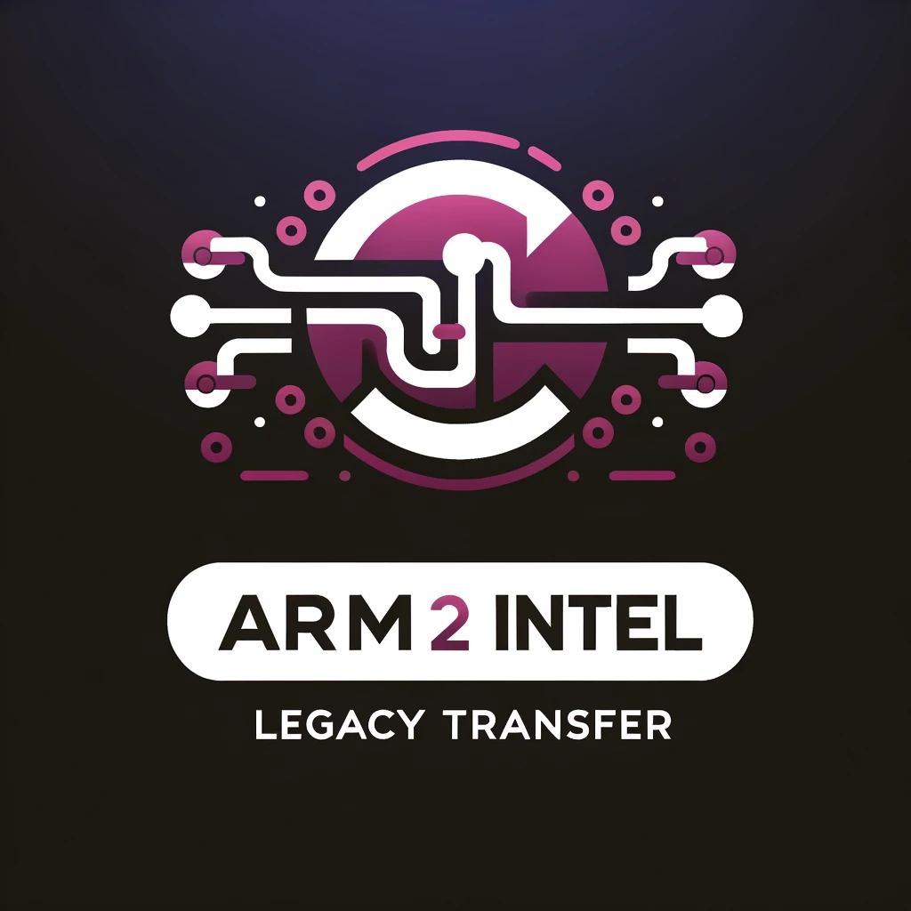

# ARM2Intel Legacy Transfer



ARM2Intel Legacy Transfer is a tool that copies applications, preferences, documents, mail data, calendar data, and other non-hidden directories from a newer Mac with an Apple-based processor (ARM architecture) to an older Intel Mac with an older OS version. It ensures compatibility by excluding applications that are not universal binaries (compatible with both Intel and Apple Silicon architectures).

This script was created because the Apple migration assistant does not let you migrate settings from a new Operating System to an older one. This is probably because things break when you do. Expect things to break, use at your own risk, and only use this on a fresh install of OSX on a wiped drive.

## Usage

### Cloning the Repo and Creating an Environment

1. **Clone the Repository**:
   - Open your terminal.
   - Navigate to the directory where you want to clone the repository.
   - Run the following command to clone the repository:
     ```
     git clone https://github.com/yourusername/arm2intel_legacy_transfer.git
     ```

2. **Navigate to the Project Directory**:
   - Change to the project directory:
     ```
     cd arm2intel_legacy_transfer
     ```

3. **Download and Install Miniconda**:
   - Download Miniconda from the official site: [Miniconda](https://docs.conda.io/en/latest/miniconda.html)
   - Choose the installer for your operating system and architecture.
   - Follow the installation instructions on the site.

4. **Create and Activate a Conda Environment**:
   - Create a new conda environment with Python 3.9:
     ```
     conda create --name arm2intel_legacy_transfer python=3.9
     ```
   - Activate the environment:
     ```
     conda activate arm2intel_legacy_transfer
     ```

5. **Install Required Packages**:
   - If you have a `requirements.txt` file, install the required packages:
     ```
     pip install -r requirements.txt
     ```

6. **Open VSCode**:
   - Open VSCode and navigate to the project directory:
     ```
     code .
     ```

### The Next Steps are Recommended to Avoid Multiple Prompts for a Password

7. **Generate SSH Keys (if not already done)**:
   - Run the following command to generate SSH keys:
     ```
     ssh-keygen -t rsa -b 4096 -C "your_email@example.com"
     ```
   - Press Enter to accept the default file location and enter a passphrase if you want (or leave it empty for no passphrase).

8. **Copy the Public Key to Your Older Mac**:
   - Run the following command to copy the public key to your older Mac:
     ```
     ssh-copy-id username@remote_ip
     ```
   - Replace `username` and `remote_ip` with your actual username and the IP address of the older Mac. This will prompt you for the password one last time.

### Running the Script

9. **Run the Script**:
   - Run the script with the following command:
     ```
     python3 arm2intel_legacy_transfer.py
     ```

10. **Follow the Prompts**:
    - Enter the IP address and username of the older Mac when prompted.
    - Respond to the prompts to decide whether to copy applications, Xcode (if present), the entire Library directory, preferences, documents, mail data, calendar data, and other non-hidden directories in the user home folder.

11. **Check Logs**:
    - The script will log its operations to `copy_mac_apps.log`.
    - If there are any errors, they will be logged in `rsync_errors.log`. You can check this file to diagnose any issues.

## Disclaimer

This script is provided "as is", without warranty of any kind. Use at your own risk. The authors are not responsible for any damage or data loss that may occur as a result of using this script.

## License

This project is licensed under the Apache 2.0 License - see the [LICENSE](LICENSE) file for details.
This detailed README provides more comprehensive instructions on cloning the repository, 